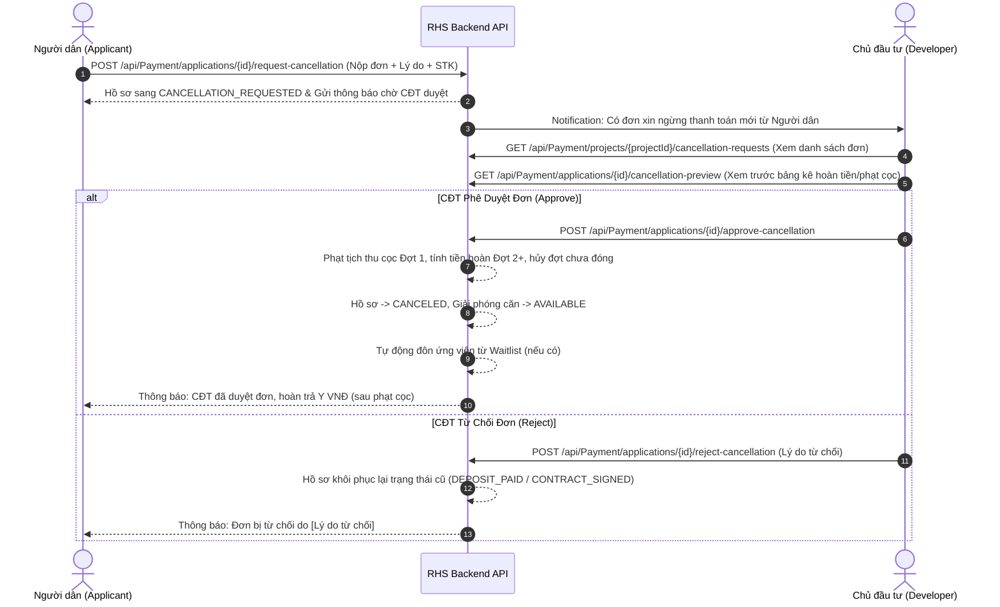

# Quy Trình Nghiệp Vụ Thanh Toán, Tính Lãi Phạt & Xử Lý Kịch Bản Luồng Xấu (3-6 Đợt & Waitlist)

Tài liệu chi tiết quy trình nghiệp vụ thanh toán tiền mua nhà ở xã hội (Đợt 1 đặt cọc $\le 30\%$, Tiến độ Đợt 2-6 từ 3 đến 6 đợt), công thức tính **lãi phạt trễ hạn (0,05%/ngày)** và quy trình 3 kịch bản xử lý luồng xấu (chậm đóng, đơn xin ngừng thanh toán được CĐT duyệt, và cưỡng chế thu hồi căn đôn Waitlist).

---

## I. Cấu Hình Tiến Độ Thu Tiền Linh Hoạt (3 đến 6 Đợt)

### 1. Nguyên Tắc Cấu Hình
- **Số đợt thu**: Chủ đầu tư (CĐT) chủ động thiết lập từ **3 đến 6 đợt đóng tiền** cho dự án thông qua API `ProjectMilestone`.
- **Đợt 1 (Đặt cọc)**: Thu tối đa $\le 30\%$ giá trị căn hộ (mặc định 10% khi trúng bốc thăm/cấp suất).
- **Các Đợt Tiếp Theo (2+)**: Tổng phần trăm tất cả các đợt phải đúng bằng **100%**.
- **Đợt Cuối Cùng**: Nhận số tiền phần dư còn lại sau khi trừ tổng các đợt trước để đảm bảo không bị sai lệch số lẻ cent/đồng.

---

## II. Công Thức Tính Lãi Phạt Trễ Hạn (0,05% / Ngày)

### 1. Điều Kiện Áp Dụng Lãi Phạt
- Mức phạt trễ hạn được cố định là **0.05% / ngày** (`0.0005` per day) áp dụng cho **số tiền gốc của đợt đang trễ hạn**.
- Khi một đợt thu chuyển sang trạng thái `OVERDUE` (ngày hiện tại > `DueDate` và chưa thanh toán đầy đủ), hệ thống tự động tính lũy tiến số ngày quá hạn:
  $$\text{OverdueDays} = \max\left(0, \lfloor \text{CurrentDate} - \text{DueDate} \rfloor\right)$$

### 2. Công Thức Tính Tiền Lãi Phạt
$$\text{PenaltyAmount} = \text{InstallmentAmount} \times 0.0005 \times \text{OverdueDays}$$

### 3. Tổng Số Tiền Phải Thanh Toán Của Đợt Trễ Hạn
$$\text{TotalPayableAmount} = \text{InstallmentAmount} + \text{PenaltyAmount}$$

---

## III. Quy Trình Xử Lý 3 Kịch Bản Luồng Xấu (Bad Flows)

### Kịch Bản 1: Trễ Hạn Đóng Tiền & Cộng Dồn Lãi Phạt
- **Mô tả**: Người dân đóng chậm quá hạn 1 đợt.
- **Xử lý**:
  - Hệ thống tự động tính lãi phạt 0,05%/ngày cộng dồn.
  - Khi người dân vào thanh toán qua VNPay, tổng số tiền phải trả = Tiền gốc đợt + Tiền lãi phạt trễ hạn tính đến thời điểm bấm thanh toán.

---

### Kịch Bản 2: Đơn Xin Ngừng Thanh Toán (Tự Nguyện Rút Hồ Sơ - Có Thẩm Định & Duyệt Từ CĐT)

Quy trình áp dụng cơ chế **Maker - Checker** (Người dân nộp đơn $\rightarrow$ CĐT phê duyệt/từ chối):

- **Quy tắc Phạt Cọc & Hoàn Tiền khi CĐT duyệt**:
  - **Phạt cọc (Đợt 1)**: Tịch thu toàn bộ 100% số tiền đặt cọc Đợt 1 (hoàn trả Đợt 1 = 0 VND).
  - **Hoàn trả Đợt 2+**: Hoàn lại số tiền các Đợt 2 trở đi mà người dân đã đóng sau khi khấu trừ tiền lãi phạt trễ hạn chưa trả:
    $$\text{RefundAmount} = \max\left(0, \sum \text{PaidAmount}_{\text{Phase } 2+} - \sum \text{UnpaidPenalties}\right)$$

---

### Kịch Bản 3: Cưỡng Chế Hủy Căn Do Quá 2 Đợt Không Thanh Toán & Đôn Waitlist

- **Mô tả**: Người mua chậm đóng tiền liên tiếp **từ 2 đợt trở lên** (`OverduePhasesCount >= 2`) mà không có lý do chính đáng.
- **Xử lý**:
  - **Endpoint CĐT**: `POST /api/Payment/applications/{applicationId}/cancel-contract` với `"isForcedRevocation": true`.
  - Chủ đầu tư đơn phương chấm dứt hợp đồng.
  - Tịch thu toàn bộ tiền cọc Đợt 1 (Phạt cọc 100%).
  - Hoàn trả tiền các Đợt 2+ (sau khi trừ các khoản nợ phạt trễ hạn).
  - **Tự động đôn Waitlist**: Chuyển giao căn hộ cho ứng viên tiếp theo có `WaitlistNumber` nhỏ nhất trong Danh sách chờ của dự án. Người được đôn sẽ được chuyển sang `APPROVED`, được cấp lại `ApartmentId` vừa thu hồi và nhận thông báo gia hạn 48h để xác nhận nộp cọc.

---

## IV. Bảng Tổng Hợp API Nghiệp Vụ

| Vai trò | API Endpoint | Mô tả |
| :--- | :--- | :--- |
| **Người dân** | `POST /api/Payment/applications/{id}/request-cancellation` | Nộp đơn xin ngừng thanh toán (chuyển status $\rightarrow$ `CANCELLATION_REQUESTED`) |
| **CĐT** | `GET /api/Payment/projects/{projectId}/cancellation-requests` | Lấy danh sách các đơn xin ngừng thanh toán đang chờ duyệt |
| **CĐT** | `GET /api/Payment/applications/{id}/cancellation-preview` | Xem trước bảng kê phạt cọc Đợt 1, tiền đợt 2+ đã đóng & tiền thực hoàn |
| **CĐT** | `POST /api/Payment/applications/{id}/approve-cancellation` | **Phê duyệt đơn xin ngừng thanh toán** $\rightarrow$ Thực hiện phạt cọc, hoàn tiền & đôn Waitlist |
| **CĐT** | `POST /api/Payment/applications/{id}/reject-cancellation` | **Từ chối đơn xin ngừng thanh toán** $\rightarrow$ Khôi phục lại trạng thái hồ sơ ban đầu |
| **CĐT** | `POST /api/Payment/applications/{id}/cancel-contract` | **Cưỡng chế thu hồi căn** (khi trễ hạn $\ge 2$ đợt) $\rightarrow$ Tịch thu cọc & đôn Waitlist |
| **CĐT/SXD** | `GET /api/Payment/projects/{projectId}/payment-progress` | Thống kê báo cáo tiến độ thu hồi vốn & tổng tiền nợ phạt của dự án |
